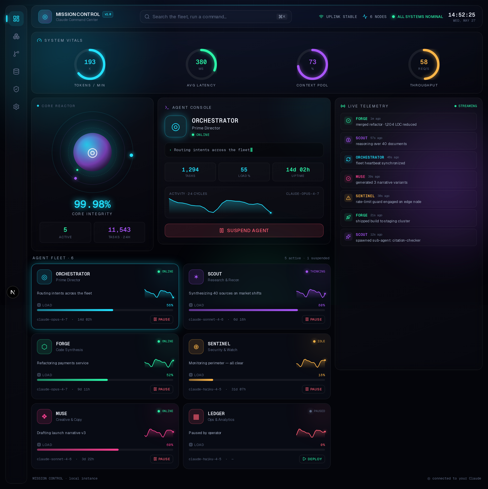

# ◎ Mission Control

A beautiful, dopamine-inducing command center for orchestrating Claude and a
fleet of AI agents — hosted locally. Built as a sci‑fi "operating system"
dashboard: a glowing core reactor, live telemetry gauges, a controllable agent
fleet, a streaming activity feed, and a ⌘K command palette.



## Highlights

- **Core Reactor** — a pulsing, orbiting Claude core with live integrity readout.
- **System Vitals** — animated radial gauges (tokens/min, latency, context pool, throughput) that drift in real time.
- **Agent Fleet** — six agents (Orchestrator, Scout, Forge, Sentinel, Muse, Ledger), each with live load, sparklines, status, and one‑click deploy / pause.
- **Agent Console** — a focused detail view for the selected agent with a live task terminal and stats.
- **Live Telemetry** — a streaming activity feed that animates new events in.
- **Command Palette** — press `⌘K` / `Ctrl+K` to focus or toggle any agent.
- **Motion everywhere** — entrance staggers, hover lifts, count‑ups, and orbit animations via Framer Motion.

## Stack

- [Next.js 16](https://nextjs.org) (App Router) + React 19
- [Tailwind CSS v4](https://tailwindcss.com)
- [Framer Motion](https://www.framer.com/motion/)
- [lucide-react](https://lucide.dev) icons

## Run it locally

```bash
npm install
npm run dev
```

Open [http://localhost:3000](http://localhost:3000).

```bash
npm run build   # production build
npm run lint    # lint
```

## Structure

```
src/
  app/
    layout.tsx        # fonts, metadata, shell
    globals.css       # design tokens, theme, animations
    page.tsx          # dashboard composition + live state
  components/
    Background.tsx     # aurora mesh, grid, scanline
    TopBar.tsx         # clock + system status
    Sidebar.tsx        # OS nav rail
    ClaudeCore.tsx     # orbiting core reactor
    TelemetryPanel.tsx # radial gauges
    AgentCard.tsx      # fleet card
    AgentDetail.tsx    # agent console
    ActivityFeed.tsx   # live event stream
    CommandPalette.tsx # ⌘K palette
    primitives.tsx     # CountUp, Sparkline, RadialGauge, StatusDot
  lib/
    types.ts  data.ts  accents.ts
```

The data layer (`src/lib/data.ts`) is mock-driven and self-animating — swap it
for your own Claude / agent backend to wire it to a real fleet.
